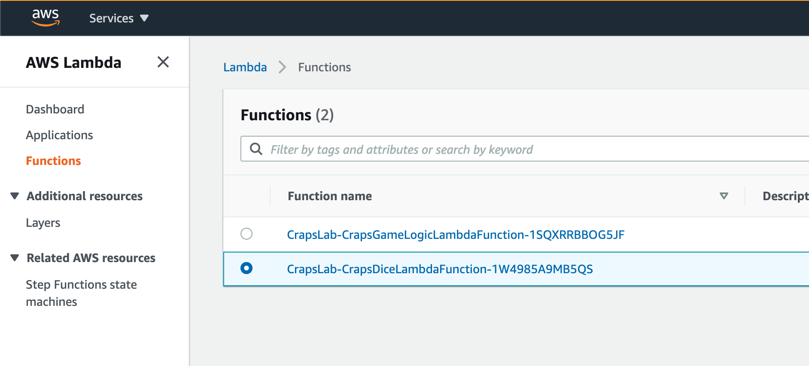
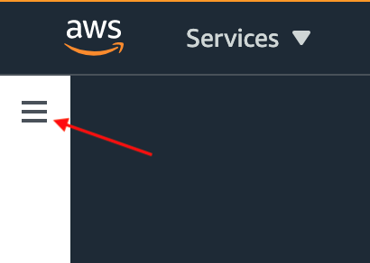
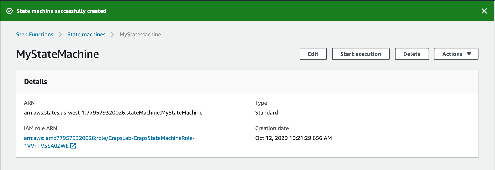

# AWS Step Functions Workshop: Building a Serverless Game of Craps


## Overview

**Objective**: 

This lab will introduce you to AWS Step Functions, the Amazon State Machine Language, and walk you through setting up a game of Craps using AWS Step Functions and AWS Lambda.

**Estimated Time**: 

45 minutes

**Target Audience**:

  - Tenure: Any 
  - Job Family: SDE, SysEng, or Architect
  - Job Function: Developer / Architect

**Prerequisites**: 

This lab assumes existing knowledge in the following areas:

  - Python: beginner level
  - AWS console access with permission to deploy cloudformation stacks

**Services Used**:

  - [AWS CloudFormation](https://aws.amazon.com/cloudformation/)
  - [AWS IAM](https://aws.amazon.com/iam/)
  - [AWS Lambda](https://aws.amazon.com/lambda/)
  - [AWS Step Functions](https://aws.amazon.com/step-functions/)


## Table of Contents

1. [Introduction](#Introduction)
2. [Deploy the CloudFormation Template](#deploy-the-cloudformation-template)
3. [Test the Dice Lambda](#test-the-dice-lambda)
4. [Create the State Machine](#create-the-state-machine)
5. [Test the State Machine](#test-the-state-machine)
6. [Walkthrough of Amazon State Machine Language Used](#walkthrough-of-amazon-state-machine-language-used)

## Introduction

AWS Lambda is an extremely powerful and efficient option for compute in the cloud. However, as applications become more complex, the number of AWS Lambda functions that make up your application generally increase. As the number of Lambdas and interactions between Lambdas increases, orchestrating the workflows can become a daunting task, especially when it comes to error handling and managing retries. In addition to that, debugging failures generally becomes more difficult as the application becomes more distributed.

Fortunately there is a service called AWS Step Functions that makes building and managing a complex distributed workflow much easier. Order of execution, error handing, retry logic, and state are all managed by the state machine, which removes a significant burden from the developer. You even get a visual flow diagram of your workflow in realtime as the state machine executes.

AWS Step Functions can seem intimidating at first, but they are actually are easy to configure and quick to set up. In this lab we are going to use AWS Step Functions to build a complex workflow, and since RE: Invent (or AWS Summit) is virtual this year instead of being hosted at Las Vegas, what a better way to learn AWS Step Functions than to build a popular Vegas game: Craps.

Craps is a dice game where players bet on the outcome of a roll, or series of rolls, using a pair of 6 sided dice. If you’ve ever seen a Craps table, you know that Craps is a complex game, with hundreds of ways to bet. Due to time constraint we are going to build only the fundamental bets of the game, which are the Pass Line and Don’t Pass bets.

Traditionally players bet the pass line, which is betting that the shooter wins. The shooter can win by rolling a seven (7) or eleven (11) on the first roll, which is called the “come out roll”. If a two (2), three (3), or twelve (12) is rolled on the come out roll, this is called “Crapping out”, and the shooter loses and so does the pass line bet. If any other number is rolled (4, 5, 6, 8, 9, 10), then that number becomes the “Point”. The shooter will then roll until they either roll the point, which results in a win, or they roll a seven, which results in a loss.

One unique attribute of craps is that you can bet that the house wins (betting against the shooter), which is the don’t pass bet. While this bet can make you unpopular with the other players at the table (who are betting the pass line), it’s a nice option to have when the table is on a losing streak. The don’t pass bet is basically the inverse of the pass line bet. On the come out roll, if a 7 or 11 is rolled, the don’t pass bet will lose, if a 2, 3, or 12 is rolled, the don’t pass bet wins, and when a point is established, if the shooter makes the point before a 7 is rolled, the don’t pass bet loses, and if the shooter rolls a 7 before the point is rolled, the don’t pass bet wins.

## Deploy the CloudFormation Template

1) Download the AWS CloudFormation template: `crapsStateMachineStack.yml`.

2) Log into the AWS Console.

3) Under "Find Services", type "CloudFormation", and select "CloudFormation" from the list.


4) Select "Create stack".


5) Select "Upload template file", select the file that was downloaded in step 1 (crapsStateMachineStack.yml), then select "Next".


6) Input "CrapsLab" for the Stack name, then select "Next".


7) On the Configure stack options screen, continue with the defaults by selecting "Next".

8) On the next screen, scroll down to the bottom of the page and select the check-box acknowledging that AWS CloudFormation might create IAM resources.


9) Select "Create stack".


10) On the next screen, after waiting a moment, press the refresh button. The events on the "Events" tab should indicate that the CrapsLab stack has a status of "Create_Complete".


11) Inspect the resources created by CloudFormation by selecting the "Resources" tab.


12) The CloudFormation template deployed should have created two AWS Lambda functions and two AWS IAM roles.

## Test the Dice Lambda

1) Select the "Services" dropdown and type "Lambda", then select "Lambda" from the list.


2) Ensure that `Lambda > Functions` is selected, if not select "Functions" from the menu on the left.

3) Select the function named "CrapsLab-CrapsDiceLambdaFunction-xxxxx" (where xxxxx is a random identifier). If needed, add a filter "DiceLambda".



4) Scroll down to the "Function code" section. Observe the code used.


5) Note how the logger and the unique_seed are being initialized in the global scope. This allows these variables to persist between Lambda calls while the Lambda is still “warm”. Generally it is a best practice to initialize loggers, and other clients in the global scope, so they can be reused between Lambda calls.

6) Test the Dice Lambda in the console by creating a test event. Select the dropdown "Select a test event", then select "Configure test events".


7) The Dice lambda expects a single input "bet". Remove the example key/values and add the key "bet", with the value "pass line". Name the event "testRoll", then select the "Create" button.


8) Ensure "testRoll" is selected in the "Select a test event" dropdown, then select the "Test" button to trigger the test event.


9) Observe the execution results. Test out the Lambda by triggering a couple more test events.


## Create the State Machine
1) Select the "Services" dropdown and type "Step", then select "Step functions" from the list.


2) Expand the menu on the left side by clicking the "hamburger" menu icon.



3) Select "State machines" from the menu on the left.


4) Select the "Create state machine" button.


5) Keep the default options and scroll down to "Definition".


6) Copy the contents of `statemachine.json` into a text editor.

7) Replace the two instances of <INSERT DICE LAMBDA ARN HERE> with the actual ARN from your deployed "CrapsDice" Lambda. (The ARN can be found at the top right of the screen when the "CrapsDice" Lambda is viewed in the AWS console)

8) Replace the <INSERT GAME LOGIC LAMBDA ARN HERE> with the actual ARN from your deployed "CrapsGameLogic" Lambda. (The ARN can be found at the top right of the screen when the "CrapsGameLogic" Lambda is viewed in the AWS console)


9) Select the "Next" button.

10) On the "Specify details" screen, set the State machine name to "CrapsStateMachine".

11) On the "Permissions" section of the "Specify details" screen, select "Choose an existing role", then select "CrapsLab-CrapsStateMachineRole-xxxxx" from the list (where xxxxx is a random identifier)


12) Select the "Create state machine" button to create the state machine.





## Test the State Machine
1) Select the "Start execution" button.


2) The Craps state machine takes an optional input, "bet", there are two valid inputs "pass line" and "don't pass", if omitted or if the input is not valid, the bet parameter will default to "pass line". Specify the "bet" as "pass line" for this first test.


3) Select the "Start execution" button to execute the state machine with the given input parameters.


4) On the next screen, you can view the execution of the state machine,


5) In the example above, when inspecting the first image, we can conclude that the state machine rolled the dice, and since there was no win or loss outcome, began to roll the dice again. In the second image we can see that there was a win outcome. 

6) Let's step through the state machine execution to see what happened in detail. Scroll down to "Exection event history"


7) Expand the arrow next to ID 2 (PassStateEntered) to view the input to the state machine.


8) Let's inspect the next step, "RollTwoDiceInParallel". Expand the arrow next to ID 4 to view the input for this step.


9) Note that the input is exactly the same as the input to the pass state. This is because a Pass state will pass it's input to the output, without performing any work. Generally pass states are used for debugging state machines.

10) Let's inspect the outcome of our dice roll. Since we rolled two dice in parallel, we'll have two steps to check. Expand the arrow next to the "TaskState Exited" for Dice1 and Dice2 (ID 13 and 15)


11) In the example above, we rolled a two (2) on Dice1, and a four (4) on Dice2. Since this was our first roll, it means that we established a point of six (6), meaning we need to roll a six (6) before we roll a seven (7) to win.

12) Let's inspect the outcome of our "EvaluateRoll" step. Expand the arrow next to ID 22.


13) We can see that our last roll was two and four (2, 4), which means we rolled a six (6) and since this is our first roll we established a point of six (6). We can also see the roll history and the best for the execution.

14) Since roll history is being tracked, lets scroll all the way to the end of the execution. If necessary, select the "Load more events" button. Expand the arrow next to the last ID (50 in this example) to view the conclusion of the execution.


15) In this example there were only two rolls: on the first roll, we rolled a six (6), establishing a point of six (6). On the next roll, we rolled a six (6) again. Since we rolled the point before rolling a 7, we win!


## Walkthrough of Amazon State Machine Language Used
1) The state machine must have an entry point.  This is specified using the “StartAt” parameter. In the lab, we used a pass state called “Roll”.

```
    {
  "Comment": "An example state machine that plays a game of craps",
  "StartAt": "Roll",
  "States": {
    "Roll": {
      "Type": "Pass",
      "Next": "RollTwoDiceInParallel"
    },
    ...
```
2) The steps that make up the state machine are contained in an object, “States”. The name of the step is the key, and the definition is the value. Note that both branches have a single step which are the “Task” type. A task performs work by using an activity or AWS Lambda function. In our lab we use an AWS Lambda function to perform the task.

```
  "States": {
    "Roll": {
      "Type": "Pass",
      "Next": "RollTwoDiceInParallel"
    },
    "RollTwoDiceInParallel": {
      "Type": "Parallel",
      "Branches": [
        {
          "StartAt": "Dice1",
          "States": {
            "Dice1": {
              "Type": "Task",
              "Resource": "<INSERT DICE LAMBDA ARN HERE>",
              "End": true
            }
          }
        },
        {
          "StartAt": "Dice2",
          "States": {
            "Dice2": {
              "Type": "Task",
              "Resource": "<INSERT DICE LAMBDA ARN HERE>",
              "End": true
            }
          }
        }
      ],
      "Next": "EvaluateRoll"
    },

```
3) Since our dice lambda represents one of the two dice rolled, we need to execute it in parallel. In our “Parallel” state we specify the branches of the execution. Since there are two dice, we have two branches, each with their own “StartAt” and “States”.

4) When the “RollTwoDiceInParallel” step completes, the game logic lambda is invoked in the “EvaluateRoll” step. Note that since there were two dice rolled in parallel in the previous step, this Lambda invoked in this step will receive two events instead of just one.

```
  "EvaluateRoll": {
    "Type": "Task",
    "Resource": "<INSERT GAME LOGIC LAMBDA ARN HERE>",
    "Next": "Outcome"
  },

```

5) Once the game logic lambda is completed, we have three possible outcomes: win, lose, or continue to roll. In Amazon State Language, there is a type to handle this case: the Choice state“. In the lab we evaluate the results.outcome variable to determine what the next state is. If the variable is equal to ”Win“, we move on to the Win state, if the variable is equal to ”Lose“, we move to the Loss state, and we handle if its neither a win or a loss using the default: we keep rolling.

```
    "Outcome": {
      "Type": "Choice",
      "Choices": [
        {
          "Variable": "$.results.outcome",
          "StringEquals": "Win",
          "Next": "Win"
        },
        {
          "Variable": "$.results.outcome",
          "StringEquals": "Lose",
          "Next": "Loss"
        }
      ],
      "Default": "Roll"
    },
    "Win": {
      "Type": "Pass",
      "End": true
    },
    "Loss": {
      "Type": "Pass",
      "End": true
    }
```

https://docs.aws.amazon.com/step-functions/latest/dg/concepts-amazon-states-language.html
